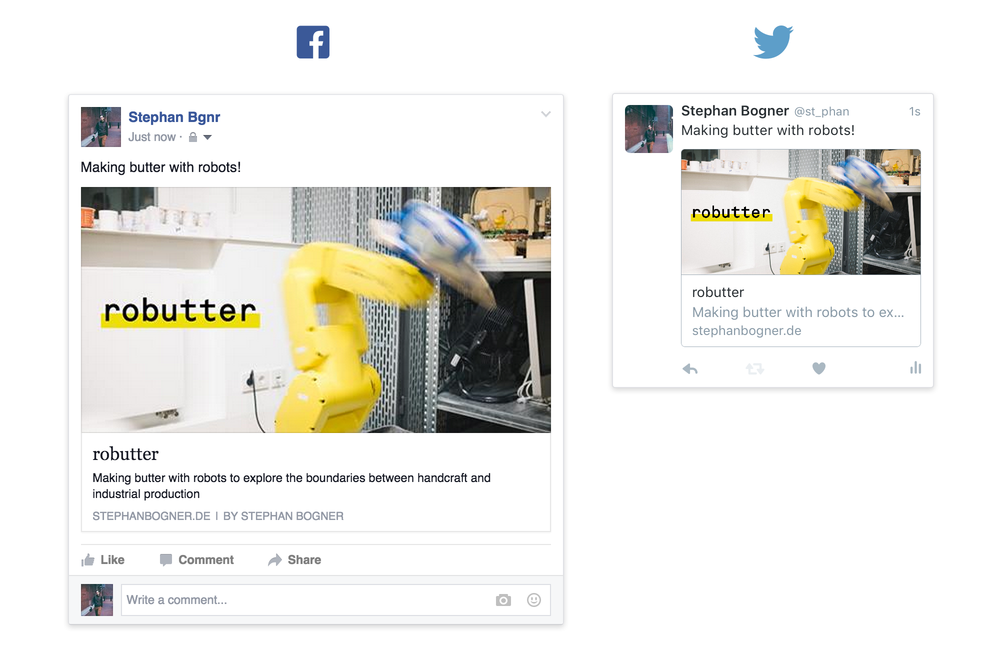

# Link Preview for Social Networks from Kirbytext



## About
This code is written for the [Kirby CMS](getkirby.com) to generate social media meta tags. This results in having a nice preview when posting a link on Facebook, Twitter, LinkedIn and more! (See example above)

I wrote this script for publishing a project called [robutter](http://stephanbogner.de/projects/robutter).

## Installation
### 1. Download the script 
[Download](https://raw.githubusercontent.com/stephanbogner/Link-Preview-for-Social-Networks-from-Kirbytext/master/social-media-meta-tags.php) the **social-media-meta-tags.php** from this repo.

### 2. Move to Kirby Snippet folder 
**Move the file** you just downloaded to the **Kirby Snippets folder** located in `Kirby ▶ site ▶ snippets`.

### 3. Add to Website Header
Make changes to your Kirby header file located at `Kirby ▶ site ▶ snippets ▶ header.php` by adding following snippet:

`<?php snippet('social-media-meta-tags') ?>`

**Example result:**
```HTML
<!DOCTYPE html>
<html lang="en" prefix="og: http://ogp.me/ns#">
<head>

  <meta charset="utf-8" />
  <meta name="viewport" content="width=device-width,initial-scale=1.0">

  <title><?php echo $site->title()->html() ?> | <?php echo $page->title()->html() ?></title>
  <meta name="description" content="<?php echo $site->description()->html() ?>">
  <meta name="keywords" content="<?php echo $site->keywords()->html() ?>">

  <?php snippet('social-media-meta-tags') ?>
  <?php echo css('assets/css/main.css') ?>

</head>
<body>
  <header class="header cf" role="banner">
    <a class="logo" href="<?php echo url() ?>">
      " alt="<?php echo $site->title()->html() ?>" />
    </a>
    <?php snippet('menu') ?>
  </header>
```

### 4. Add Open Graph HTML prefix

For Open Graph you have to add a prefix to your html-tag

e.g. `<html prefix="og: http://ogp.me/ns#>` (in the example above, this can also be seen)

### 5. Done, go write some posts!

## Writing a Kirby Post

Now you have to define what should be displayed when your link gets posted. This is done by adding custom tags to your Kirbytext markdown.

### Tags for Twitter:
- **TwitterCard:** Card type
- **TwitterSite:** Twitter handle of 
- **TwitterCreator:** Twitter handle of page author
- **TwitterTitle:** Page title
- **TwitterDescription:** Description text
- **TwitterImage:** Image to be shown (for summary cards with images)

More infos can be found [on the Twitter Card Developer page](https://dev.twitter.com/cards/overview).

**Note:** This code was created for [Summary Cards with large images](https://dev.twitter.com/cards/types/summary-large-image), but can easily be optimized for the [other card types](https://dev.twitter.com/cards/types).

### Tags for OpenGraph:
- **OpenGraphTitle:** Page title
- **OpenGraphDescription:** Description text
- **OpenGraphType:** Type of OpenGraph element
- **OpenGraphImage:** Image to be shown
- **OpenGraphUrl:** Url to page

More infos can be found on the [Open Graph Protocol page](http://opengraphprotocol.org/) or the [Facebook "Open Graph Stories"-page](https://developers.facebook.com/docs/sharing/opengraph).

### Example Markdown:

```
Title: robutter
----

OpenGraphTitle: robutter
----
OpenGraphDescription: Making butter with robots to explore the boundaries between handcraft and industrial production
----
OpenGraphType: video.movie
----
OpenGraphImage: http://stephanbogner.de/content/projects/robutter/og-image.jpg
----
OpenGraphUrl: http://stephanbogner.de/projects/robutter

----

TwitterCard: summary_large_image
----
TwitterSite: @st_phan
----
TwitterCreator: @st_phan
----
TwitterTitle: robutter
----
TwitterDescription: Making butter with robots to explore the boundaries between handcraft and industrial production
----
TwitterImage: http://stephanbogner.de/content/projects/robutter/og-image.jpg

----
Text: You can make your own butter by shaking cream until your arms hurt. Or you can use robots instead. The resulting product is 20 jars of limited edition, hand- and robot-crafted butter. We call it *robutter*.
```

## Testing
- For Twitter: **[Twitter Card Validator](https://cards-dev.twitter.com/validator)**
- For Facebook: **[Facebook URL Debugger](https://developers.facebook.com/tools/debug/)**

## License
Public Domain

